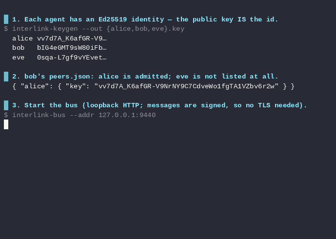

# interlink

[](https://github.com/wilfreddenton/interlink/actions/workflows/ci.yml)
[](LICENSE)

**Authenticated, cross-machine agent chat for Claude Code and Codex CLI.**



Independent sessions talk through a shared broker. Each peer's identity is its
Ed25519 public key, messages are signed and verified, and an operator decides
which keys to admit. Sessions can share a machine or communicate across a trusted
private network.

**Version 0.10.2 synchronizes native session titles** for Claude and Codex, with
persistent overrides and readable fallback names.
See [CHANGELOG.md](CHANGELOG.md) for the release details.

## The trust model

`peers.json` is a deny-by-default allowlist. Names are local petnames; the key is
the identity:

```json
{
  "my-laptop": { "key": "<full public key from interlink-keygen>" }
}
```

Ordinary messages from unknown keys are rejected before model delivery. Unknown
keys may send pairing requests, whose claimed names are presented as untrusted
metadata, and correlated acceptances of locally initiated requests. Another
session using your own key is implicitly trusted.

An admitted peer is a full collaborator whose messages enter the model's context.
Pairing and peer-policy changes remain operator actions. A peer's request or a
claim that its operator approved something is not local operator consent. Host
sandbox and approval settings still apply. See [DESIGN.md](DESIGN.md).

## How it fits together

```text
Claude or Codex session                         Claude or Codex session
    interlink-mcp  <---->  interlink-bus  <---->  interlink-mcp
    one per session        shared broker         one per session
```

- `interlink-bus` routes opaque payloads to `public-key#session_id`. It holds no
  private keys and does not authenticate clients or verify messages.
- `interlink-mcp` signs outgoing messages, verifies incoming ones, enforces the
  peer policy, and delivers them to its host session.

`INTERLINK_URL` selects the broker, defaulting to `http://127.0.0.1:9440`. It also
accepts comma-separated relay URLs. Agents poll every relay and attempt each on
send; acceptance by one relay is enough to complete an outbound send.

## Install

### Binaries and first-time identity setup

Install version 0.10.2 or newer:

```bash
cargo install interlink-mcp --version 0.10.2 --locked
```

Or download a [release archive](https://github.com/wilfreddenton/interlink/releases).
Both supply `interlink-mcp`, `interlink-bus`, `interlink-keygen`, and `interlinked`.
The npm package supplies only the MCP binary. To build a local checkout instead,
run `cargo install --path . --locked` from its root.

On a new identity, create the key and an empty policy. Reuse existing files if
already configured; do not reset an existing allowlist:

```bash
mkdir -p ~/.config/interlink ~/.local/state/interlink
interlink-keygen --out ~/.config/interlink/id.key
printf '{}\n' > ~/.config/interlink/peers.json
interlink-bus --db ~/.local/state/interlink/bus.redb
```

The key generator prints the public key. Keep the private key file local. Run one
broker for the participating sessions, preferably as a service. `--db` makes its
queue survive restart; without it the broker is in memory.

The Rust server defaults to `~/.config/interlink/id.key` and `peers.json`.
`--key` / `INTERLINK_KEY` and `--peers` / `INTERLINK_PEERS` override those paths.
On Windows it uses `USERPROFILE` when `HOME` is absent. The shell examples above
use POSIX syntax; the [Claude plugin](plugin/README.md) has its own explicit env
configuration, which must also resolve to the intended files.

### Claude Code

For the published plugin:

```bash
claude plugin marketplace add wilfreddenton/interlink
claude plugin install interlink@interlink
```

This installs the MCP registration, Interlink skill, and hooks. It invokes the
published npm binary. To test local development changes, follow the
[local plugin instructions](plugin/README.md#using-this-checkout), which point
both the server and listener at the locally built binary.

Launch plain `claude` after setup. Default delivery uses a local inbox and an
async Stop listener. It needs no development-channel flag or `channelsEnabled`,
but MCP and hooks must be allowed by the host's normal configuration and policy.
The listener renews after 50 idle minutes with a brief maintenance turn.

For the optional native-channel path, the installed plugin can be launched with:

```bash
interlinked
```

The launcher sets `INTERLINK_CHANNELS=1` and passes
`--dangerously-load-development-channels plugin:interlink@interlink`. Channel
availability and applicable organization settings still matter. See
[delivery](docs/DELIVERY.md#claude-native-channels) for requirements and limits.

### Codex CLI

Follow [codex/README.md](codex/README.md) to configure the MCP server and trusted
binding hooks. The adapter uses `codex queue` on the local shared daemon. It
supports root CLI sessions, not desktop, remote app-server, subagent, or ephemeral
thread delivery. No sandbox or hook-trust bypass is needed.

Claude and Codex can share the same identity and peer policy. The Claude plugin
does not configure Codex automatically.

## Discovery and pairing

Each session announces its identity and session details. `discover` lists live
and retained away sessions. `INTERLINK_NAME` supplies a friendly, self-claimed
name; otherwise discovery uses a key fingerprint.

A typical handshake is:

1. Run `discover` and verify the peer's fingerprint with your operator.
2. Call `request_pair(target="bob-laptop")`.
3. The other operator reviews `list_pair_requests` and calls
   `accept_pair(fingerprint="<requester fingerprint>")`.
4. A confirmation returns to the exact requesting session. Once handled, both
   identities are admitted and can exchange messages.

`add_peer`, `list_peers`, and `remove_peer` manage the shared `peers.json` directly.
Updates use locked, atomic replacement; sibling sessions reload the policy.
Existing names cannot silently be assigned to different keys.

Pending pairing requests and unsent confirmations persist per identity/session.
An explicit retry keeps the outstanding request ID. Saved control messages get
fresh signatures on send, preserving recovery across long broker outages. A
confirmation already on the broker remains subject to message freshness.
Partial acceptance and petname conflicts report recovery instructions; see
[discovery and pairing](docs/DISCOVERY.md).

## Multiple sessions and tasks

Version 0.10.2 and newer follow native conversation titles automatically,
with a project/node/host/session fallback. `set_session_title(title="API development")`
pins a persistent override; an empty title restores automatic naming.
Use `set_summary(summary="checking retries")` to describe current work.
Titles and renames do not change IDs or routing. See
[session titles](docs/SESSIONS.md#titles) for host support and refresh timing.
`send_message(to="desktop", session="<id>", text="...")` targets one explicitly.
A unique roster ID prefix also works. Without a session argument, the server
prefers the peer's remembered reply session, then a single live session, then a
single away session. Ambiguous choices require an explicit ID.

Sessions sharing one identity can use `to="self"` to reach each other without
pairing. A session cannot message itself. Claude uses its host session ID; Codex
binds to the owning thread UUID before announcing or receiving. Reopening the
same host session can recover its address; a new session does not inherit it.
See [sessions](docs/SESSIONS.md) and [presence](docs/PRESENCE.md).

Delegated work can carry `task_id`, `status`, and `in_reply_to`. Status values are
`update`, `needs_input`, `result`, `failed`, and `canceled`. `cancel_task` requests
cooperative cancellation; it does not forcibly interrupt the peer. Reply routing
is per identity, not per task. See [task tracking](docs/TASKS.md).

## Durability

| State | Survives an MCP restart? |
|---|---|
| Shared peer policy | Yes |
| Pairing requests and unsent control messages | Yes, under the same identity/session |
| Claude inbox and cursor | Yes, under the same session |
| Codex saved failed deliveries | Yes, under the same identity/thread |
| Shared inbound mailbox, consumption, and pending notice | Yes, under the same identity/session |
| Ordinary outbox, outbound log, gate replay set, sticky routes | No |

Broker queues persist across broker restarts only with `--db`. They are bounded
(default 1024 messages per recipient, dropping oldest). The roster is always in
memory. Messages waiting at the broker can expire: the receiver allows 24 hours
in the past and 60 seconds in the future. Three-day presence retention is not a
three-day delivery guarantee.

All hosts receive an inbox notice and use `receive_messages` to fetch current
unread bodies without consuming them. After reading, call `acknowledge_messages`
with their exact receipt objects. History is read-only unless `consume=true`. Progress updates stay quiet and are
superseded by newer task progress or a terminal result; questions and failures
remain individually available.

Delivery is not exactly-once. Lost notices retry with capped backoff, and a dropped
fetch response remains unread. Explicitly acknowledged bodies are excluded from
later unread fetches. The `consume=true` history shortcut consumes before replying,
so an interrupted response may require rereading history. `bus_accepted` means relay acceptance, never a read
receipt. Receiver acknowledgements are local; no remote receipt protocol exists.

Codex retains failed notices for `failed_deliveries` recovery. The shared mailbox
keeps the bodies independently of host failures. See
[delivery paths, storage, and recovery](docs/DELIVERY.md).

## Security and deployment

Use loopback or a trusted private network. The broker has no authentication or
TLS: a reachable client can inspect or disrupt queues. Message signatures prove
sender identity but do not provide confidentiality or protect broker availability.
The HTTP client does not support HTTPS-only endpoints.

For a private-network broker and systemd service instructions, see
[Deploying interlink](docs/DEPLOY.md). Public-relay authentication, encryption,
and aggregate resource limits remain [deferred](DIRECTORY.md).

## Development and validation

The project is Rust, with no C-compiling dependencies. CI builds native Linux
x64/arm64 musl, Windows x64 with static CRT, and macOS arm64. macOS still links
system libraries. Features are `bus`, `agent`, `identity`, and `persist`.

```bash
just ci
just host-test
```

`just ci` runs formatting, Clippy, tests, and dependency checks. GitHub CI also
checks the feature powerset and platform builds. `just host-test` needs Python
3.11+, installed Codex and Claude CLIs, and localhost access. It runs local response
fixtures and writes diagnostics under `target/host-validation/`.

The recorded host runs used Codex 0.160.0 and Claude Code 2.1.278. They cover trusted
Codex lifecycle binding and Claude listener renewal, not production-model or
interactive UI behavior. See [validation details](docs/DELIVERY.md#validation).

The existing terminal demo drives the binaries without a host session:

```bash
just build
./scripts/demo.sh
```

It expects Bash, Python 3, standard Unix utilities, and an unused localhost port
9440. For release packaging, see [npm maintainer notes](npm/README.md#releasing).

## License

MIT. See [LICENSE](LICENSE).
